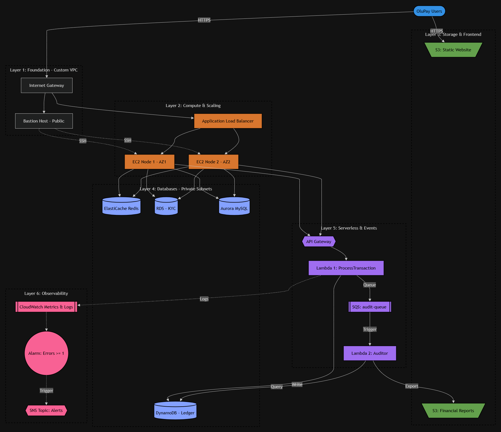

# OluPay 2.0: AWS Capstone Project

## Overview
OluPay is a Lagos-based fintech scale-up. This repository contains the architecture and infrastructure deployment for OluPay 2.0, designed to handle high-throughput financial transactions (up to 2 million users) with strict security, high availability, and automated scaling. 

## Architecture Diagram

## Architecture


## Services Used

### Networking
* Custom VPC (`10.0.0.0/16`)
* 4 subnets (2 public, 2 private) across 2 AZs
* Internet Gateway and Route Tables
* Security Groups: web-sg, bastion-sg, db-sg, redis-sg

### Compute
* EC2 Web Tier (Auto Scaling Group, t3.micro)
* Application Load Balancer
* Bastion Host for secure SSH access

### Storage
* S3 Static Website (versioning, lifecycle, encryption, CRR)
* S3 Financial Reports (Generated by Auditor Lambda)
* Pre-signed URLs for secure sharing

### Databases
* Aurora MySQL (Payments Ledger in private subnets)
* RDS MySQL (KYC in private subnets)
* DynamoDB (Transactions Ledger)
* ElastiCache Redis (OTP caching, TTL)

### Serverless
* Lambda 1: ProcessTransaction (Writes to DynamoDB and sends message to SQS)
* Lambda 2: Auditor (Triggered by SQS, queries DynamoDB, exports to S3)
* API Gateway HTTP API (POST /transaction)
* SQS Queue (Decoupling Lambda 1 and Lambda 2)
* SNS Topic (System alerts and email notifications)

### Observability
* CloudWatch Dashboard (Tracking API Gateway, Lambda, and DynamoDB metrics)
* CloudWatch Alarms (Lambda Error threshold triggering SNS)
* Logs Insights queries for rapid debugging
* Error simulation and resolution tracking

## How to Test

### 1. ALB Web Tier
Visit: `olupay-alb-1468367651.us-east-1.elb.amazonaws.com`

### 2. API Gateway
```bash
curl -X POST https://jbyjmwfog4.execute-api.us-east-1.amazonaws.com/transaction(https://.execute-api.us-east-1.amazonaws.com/transaction) \
  -H "Content-Type: application/json" \
  -d '{"sender_name": "API Tester", "receiver_name": "Test User", "amount": 1000}'
```

## Security Highlights
* All databases are deployed in isolated private subnets.
* Strict least-privilege IAM roles utilized across all services.
* Security Groups configured to prevent public access to backend resources.
